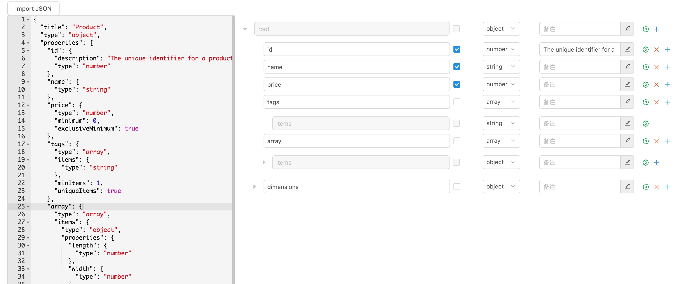

# json-schema-editor-visual-custom
A json-schema editor of high efficient and easy-to-use, base on React.



## Usage
```
npm install json-schema-editor-visual-custom
```

```js
import 'antd/dist/antd.css'
require('json-schema-editor-visual-custom/dist/main.css')
const schemaEditor = require("json-schema-editor-visual-custom/dist/main.js");
const SchemaEditor = schemaEditor({ lang: 'zh_CN'})
const defaultSchema = {
    type: 'object',
    title: 'title',
    cnname: '根节点',
    properties: {
      field_1: {
        type: 'string',
        title: 'aaa',
        description: 'fffff',
        default: "1",
        cnname: '属性1'
      },
      field_2: {
        type: 'string',
        title: 'bbb',
        description: 'fffff222',
        default: "2",
        cnname: '属性2'
      },
    },
    required: ['field_1', 'field_2'],
};

schemaChange = (e: any) => {
  console.log('schema变化', e);
};

render(
    <SchemaEditor 
        onChange={schemaChange}
        data={JSON.stringify(defaultSchema)}
    />,
  document.getElementById('root')
)
```

## Option Object

| name | desc | default |
| ---- | ----------- | --------- |
| `lg` | language, support `en_US` or `zh_CN` | en_US 

## SchemaEditor Props

| name | type | default | desc
| ---- | ----------- | --------- | --------- |
| `data` | string | null | the data of editor
| `onChange`| function | null | 
| `showEditor` | boolean | false | 
